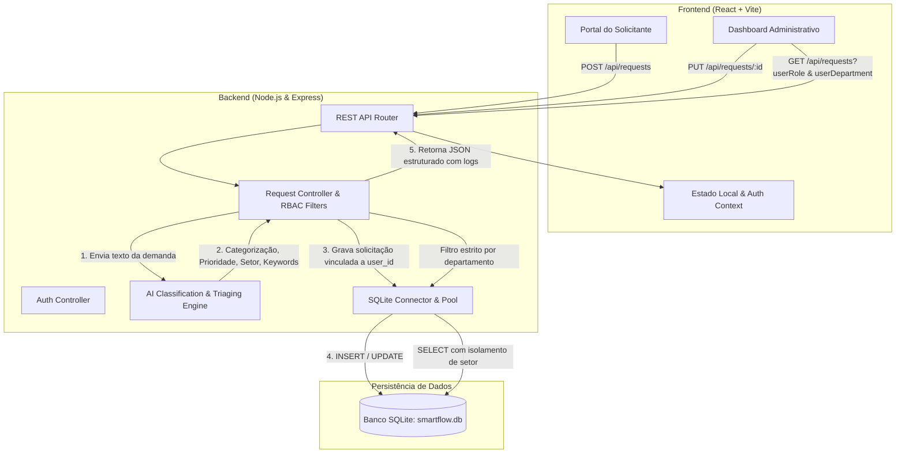

# SmartFlow — Arquitetura da Solução

O **SmartFlow** é uma plataforma corporativa de automação inteligente para classificação, triagem por IA, roteamento de demandas e controle de visibilidade departamental.

---

## 🏗️ Fluxo de Dados e Componentes



---

## 🔒 Camada de Segurança e Isolamento Departamental

1. **Administrador de TI**:
   - Visualiza e atende exclusivamente chamados direcionados para `TI` (`department = 'TI'`).
2. **Administrador de RH**:
   - Visualiza e atende exclusivamente chamados direcionados para `RH` (`department = 'RH'`).
3. **Solicitante**:
   - Acesso exclusivo aos chamados vinculados ao seu próprio `user_id` no Portal do Solicitante.
4. **Edição e Cancelamento**:
   - Solicitantes e Administradores podem corrigir ou cancelar chamados, disparando a reclassificação automática por IA.

---

## 📁 Estrutura de Diretórios (Monorepo)

```text
smartflow/
├── .agent/                  # Regras e contexto para assistentes de IA
├── doc/                     # Documentação técnica de arquitetura e schemas
│   ├── architecture.md
│   ├── database-schema.sql
│   └── database-schema-sqlite.sql
├── backend/                 # API REST Node.js + Express
│   ├── src/
│   │   ├── controllers/    # Controladores das rotas HTTP
│   │   ├── routes/         # Definição dos endpoints REST
│   │   ├── services/       # aiService.js (Motor de Triagem Inteligente)
│   │   ├── database/       # Conexão SQLite e Seed Inicial
│   │   └── app.js          # Servidor Express principal
│   ├── smartflow.db        # Banco de dados SQLite persistente
│   └── package.json
├── frontend/                # SPA React (Vite)
│   ├── src/
│   │   ├── components/     # Portal, Dashboard, Modais, Filtros, Cards
│   │   ├── App.jsx         # Aplicação principal
│   │   └── index.css       # Design System Glassmorphism
│   └── package.json
├── api/                     # Handler para deploy serverless
├── vercel.json              # Configuração de rotas unificadas
├── .gitignore               # Regras de exclusão de repositório
└── README.md                # Documentação principal
```
